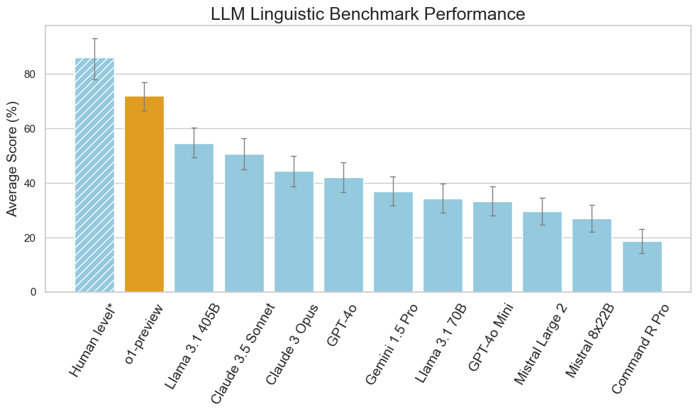
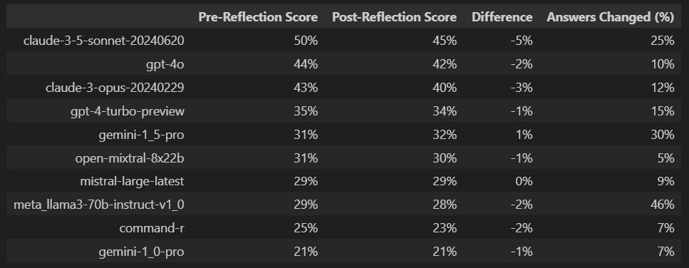

# README

# Code for "Easy Problem That LLMs Get Wrong" Paper

ArXiv Paper: [https://arxiv.org/abs/2405.19616](https://arxiv.org/abs/2405.19616)

### Benchmark Results

2024-09-13-Multi-Benchmark



**Hotz-Reflection**

[Description - LinkedIn Post](https://www.linkedin.com/posts/heikohotz_%3F%3F%3F%3F%3F%3F%3F-%3F%3F%3F%3F%3F%3F%3F-%3F%3F%3F%3F-%3F-activity-7209092819909517312-He-r?utm_source=share)

**Basic prompt template**

```
f"""
{question["multi_choice_question"]}

INITIAL ANSWER
{question["model_answer"]}

REFLECTION TASK
Review the question carfully and assess your initial answer. You can amend the answer if you wish too, otherwise return the original answer. Return in JSON format, for example:
{{"ANSWER": {random.choice(['A','B','C','D'])}}}
"""
```

**Results**

[Full JSON results](https://github.com/autogenai/easy-problems-that-llms-get-wrong/tree/c4ae6be53df49307c81803af0b5d24e19ea983f5/2024-06-21-Multi-Benchmark%20(temp%3D0)/auto_eval_hotz_outputs)



## LLM Linguistic Benchmark Tool

This tool facilitates benchmarking and statistical analysis of various Language Learning Models (LLMs) against a set of linguistic benchmark questions. It encapsulates functionalities to asynchronously query different LLMs, evaluate their responses, and perform statistical analysis to gauge the performance of each model.

### Features

- **LLM Query Interface:** Interface to send queries to different LLMs like OpenAI's GPT models, Mistral, etc.
- **Asynchronous Processing:** Batch processing of queries to LLMs for efficient data handling.
- **Benchmark and Evaluation:** Load benchmark questions, obtain model responses, and evaluate them according to a predefined rubric.
- **Statistical Analysis:** Calculate mean scores, standard deviations, and confidence intervals of model performances.

### Installation

First, clone this repository to your local machine:

```shell
git clone https://github.com/autogenai/easy-problems-that-llms-get-wrong
cd language-model-benchmark-tool
```

Then, install the required Python packages:

```shell
pip install -r requirements.txt
```

### LLM API Access

To access the various LLM services you will need valid API keys and credentials.

Place them in an `.env` file in the project root (use `.env copy` as a template):

```
OPENAI_API_KEY=your_openai_api_key_here
COHERE_API_KEY=your_cohere_api_key_here
MISTRAL_API_KEY=your_mistral_api_key_here
ANTHROPIC_API_KEY=your_anthropic_api_key_here
....
```

See [LiteLLM](https://github.com/BerriAI/litellm?tab=readme-ov-file#supported-providers-docs) for more details on how to set up for various LLM providers.

### Usage

To run the benchmark tool, jump into the `main.ipynb` notebook and run all of the cells.

Make changes to the #Variables notebook cell, which includes:

- LLM models to test
- Model hyperparameters
- Method of answer evaluation
- Whether to include reflection
- The various save paths
- The execution steps to conduct (perhaps you only want to get answers, for example)

Ultimately, this will process the benchmark questions, query the LLMs, analyse the responses, and output the statistical summary and graph.

### Most Accurate Results

The multiple-choice questions are the most deterministic and the more reliable to evaluate, as there is a clear set answer to measure against; however, open-ended questions can often expose illogical and inconsistent behavior more reliably, but are difficult to evaluate.

For open-ended questions (non multiple choice) it is best for a person to mark the LLM responses so as not to rely on the scores auto-generated in the `auto_eval_outputs` folder (by default marked by GPT-4o). You can edit the scores in the  `auto_eval_outputs` json files directly and then re-run the "generate_statistics" execution step in the  `main.ipynb` notebook to get the final results. This is how the authors did it for the paper, resulting in much lower scores than the less reliable LLM based auto evaluation.

### Modifying the Benchmark Questions

The Benchmark can be modified or extended by editing the [linguistic_benchmark.json](https://github.com/autogenai/easy-problems-that-llms-get-wrong/blob/e5d6baa16e221205ef90f0833e9ca3c30b08f713/linguistic_benchmark.json) file and [linguistic_benchmark_multi_choice.json](https://github.com/autogenai/easy-problems-that-llms-get-wrong/blob/e5d6baa16e221205ef90f0833e9ca3c30b08f713/linguistic_benchmark_multi_choice.json) in the root directory. Ensure the format remains consistent with existing entries.

### Future Work and Limitations

There are vast limitations to this approach, but further improvements might include:

* [X] Using multiple-choice questions to make evaluation more reliable.
* [X] Running inference multiple times with the temperature for each model set above zero
  (standardised and equivalent across all architectures) and generating aggregate statistics.
* [X] Building in "Hotz Reflection" to allow the model to reflect and potentially change its answer.
* [ ] Expanding the Linguistic Benchmark beyond thirty questions to increase statistical significance and test a more diverse range of inputs.
* [ ] Testing on a sample of smaller LLMs to see if performance is correlated to model size.
* [ ] Fine-tuning models with a training dataset of perturbed variations of well-known logic type problems found in the training corpora (on the internet) to see if this decreases
  overfitting variance.
* [ ] Testing advanced regularisation techniques for LLMs during the pre-training process.
* [ ] Finding better methodologies to keep LLM outputs deterministic.

### Contributing

Contributions to enhance or extend the functionality of this tool are welcomed with open arms. Please adhere to conventional coding standards and include unit tests with your pull requests.
